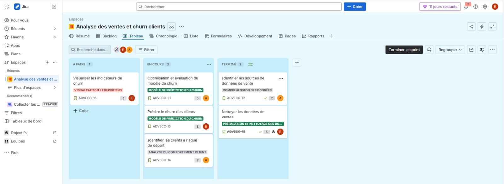
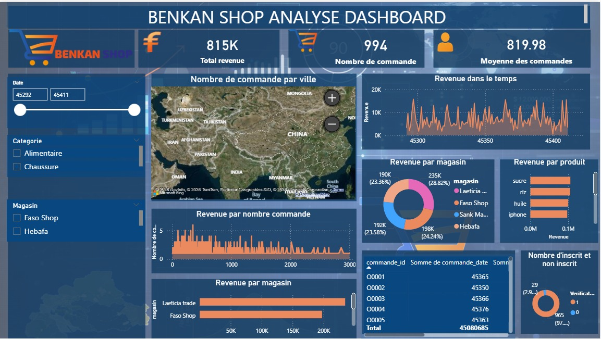

# INTRODUCING MYSELF ,

  

**Data Scientist @ Benkan Group** *Data Analytics Specialist | Predictive Modeling & Business Optimization.*

---

### ✨ Quick Facts

- 🔭 **Currently:** Data Scientist at a multi-service company.
- ⚙️ **Missions :** Predictive algorithms and Machine Learning, Dashboard creation, and decision analysis.
- ⚡ **Methodology:** Skilled in **Scrum** agile framework for structuring Data projects.
- 📫 **Contact Me :** [ebah@benkangroup.com](mailto:ebah@benkangroup.com)

---

### 🛠️ Languages and Tools

**Programming & Databases** 

**Data Visualization & BI** 

**Cloud & DevOps** 

**Project Management** 

---
### 📊 My Project Management (Agile/Scrum)

For each project, I establish a rigorous structure via **Jira** to ensure value delivery. :
* **Backlog & Sprints :** Task organization in 2-week cycles.
* **Estimation :** Use of **Story Points** to measure algorithm complexity.
* **Tracking :** **Burndown Chart** analysis to meet critical deadlines.

---
---

### 📊 Decision Analysis Dashboard
To make data actionable for the **Benkan Group** management, I designed this interactive dashboard to track key performance indicators (KPIs) in real time.
####  **Key Objectives** :
* **Performance Tracking**: Visualization of sales KPIs and churn rate by sector.
* **Decision Support:** Visual identification of customer segments requiring immediate intervention.
* **Impact:** Optimization of managers' analysis time by +15% through report automation.

  

